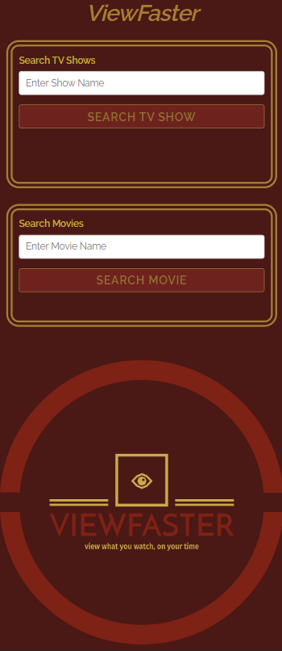
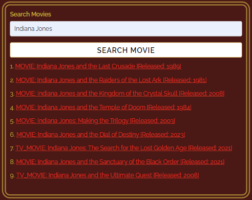

# ViewFaster

## Application Description
Our website is used for guests to view guided schedules/workable online links for movie and television media for the present and the past using secondary API’s through IMDB and TVMaze. A huge proponent of our development is ease of use and remembrance: both visually and client side. There’s nothing like getting excited for a specific piece of media and then scouring each individual streaming service trying to find where it can be found and/or how many doubloons it’ll cost me. Motivation can be boiled down to the name we gave this project: ViewFaster. At your fingertips you can find tens of thousands of media titles and view them as promptly as you can type.

## Usage
1. Navigate to the [application](https://estee3.github.io/1st-Project/)
2. Enter part or all of a TV show and/or a Movie name
3. Click on the appropriate search button to execute the API call
4. Use the results to plan your media consumption needs

## Application Features
- Auto-fit width of all sections, including our company logo
- Saves all searches within local storage according to the search field used (TV vs. Movie)
- All proceeding searches will auto-clear the current search so that concatenation does not occur, leading to a cleaner experience
- Search results will provide official links to the shows/movies that are returned within the results, providing a more in-depth way to decide on your media consumption needs
- Specific to TV Show searches: The upcoming days and times for when it will air, are provided to the end user

# Site Preview
#### Site Landing Page

#### Example TV Show Search

#### Example Movie Search

# Skills Used
- HTML
- Server-Side API's
- CSS
- JavaScript
- Skeleton CSS

# Credits
## Skeleton CSS
- [Link to Skeleton CSS Documentation](http://getskeleton.com/)

- [Link to Skeleton CSS Download](https://github.com/dhg/Skeleton/releases/download/2.0.4/Skeleton-2.0.4.zip)

- [Link to Skeleton Demo](http://getskeleton.com/examples/landing/)

### API: TV Maze (TV Shows)
- [Link to Documentation](https://www.tvmaze.com/api)
- [Example API Call]( https://api.tvmaze.com/search/shows)

### API: Watchmode (Movies)
- [Link to Documentation](https://api.watchmode.com/docs/)
- [Example API Call](https://api.watchmode.com/v1/search/?apiKey=kjG2rO76NTk8hjFjwsfFxxe205z2J4Fd2ZFn66nA&search_field=name&search_value=Ed%20Wood)

# Application Presentation Slide Deck

# License

MIT License

Copyright (c) [year] [fullname]

Permission is hereby granted, free of charge, to any person obtaining a copy
of this software and associated documentation files (the "Software"), to deal
in the Software without restriction, including without limitation the rights
to use, copy, modify, merge, publish, distribute, sublicense, and/or sell
copies of the Software, and to permit persons to whom the Software is
furnished to do so, subject to the following conditions:

The above copyright notice and this permission notice shall be included in all
copies or substantial portions of the Software.

THE SOFTWARE IS PROVIDED "AS IS", WITHOUT WARRANTY OF ANY KIND, EXPRESS OR
IMPLIED, INCLUDING BUT NOT LIMITED TO THE WARRANTIES OF MERCHANTABILITY,
FITNESS FOR A PARTICULAR PURPOSE AND NONINFRINGEMENT. IN NO EVENT SHALL THE
AUTHORS OR COPYRIGHT HOLDERS BE LIABLE FOR ANY CLAIM, DAMAGES OR OTHER
LIABILITY, WHETHER IN AN ACTION OF CONTRACT, TORT OR OTHERWISE, ARISING FROM,
OUT OF OR IN CONNECTION WITH THE SOFTWARE OR THE USE OR OTHER DEALINGS IN THE
SOFTWARE.

---

# How to Contribute

[Contributor Covenant](https://www.contributor-covenant.org/)

